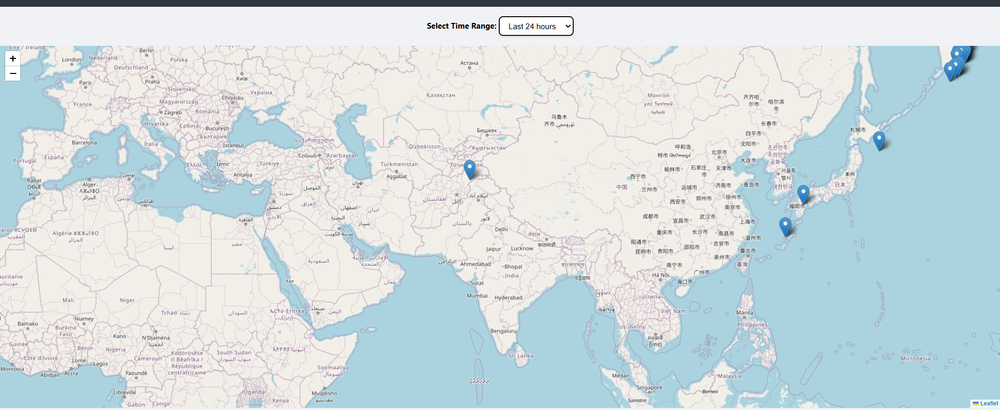
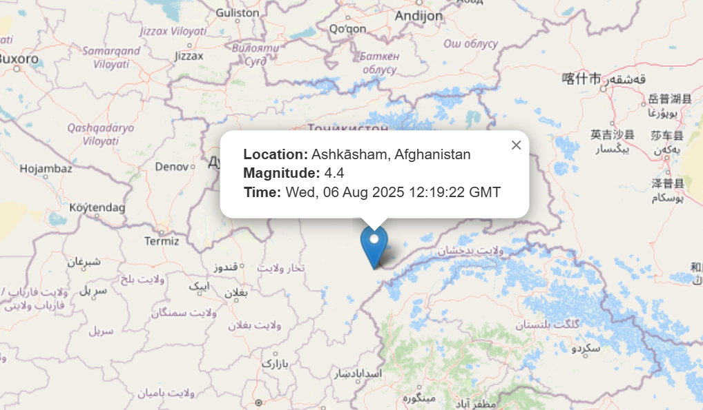

# 🌍 Earthquake Monitoring Web App

A Python Flask-based web application that fetches recent earthquake data from the USGS API, stores it in a MySQL database, and displays it on an interactive Leaflet map.

---

## 📸 Demo
 

---

## 🚀 Features

- Fetches real-time earthquake data from USGS
- Stores filtered earthquakes (mag > 4.0) into MySQL
- Interactive Leaflet map to visualize earthquakes
- Time filter dropdown (1h to 24h)
- Auto-refreshes data when app starts

---

## ⚙️ Tech Stack

- Backend: Python, Flask
- Frontend: HTML, CSS, JavaScript, Leaflet.js
- Database: MySQL
- API Source: USGS Earthquake API

---

## 🛠 Setup Instructions

### 1. Clone the Repository

```bash
git clone https://github.com/your-username/earthquake-monitoring-app.git
cd earthquake-monitoring-app
