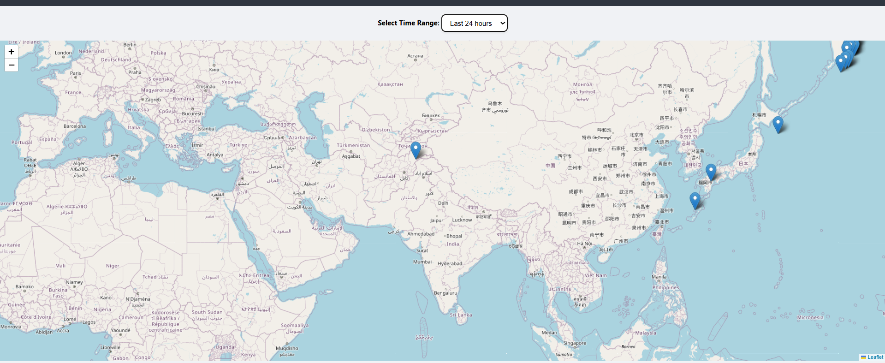
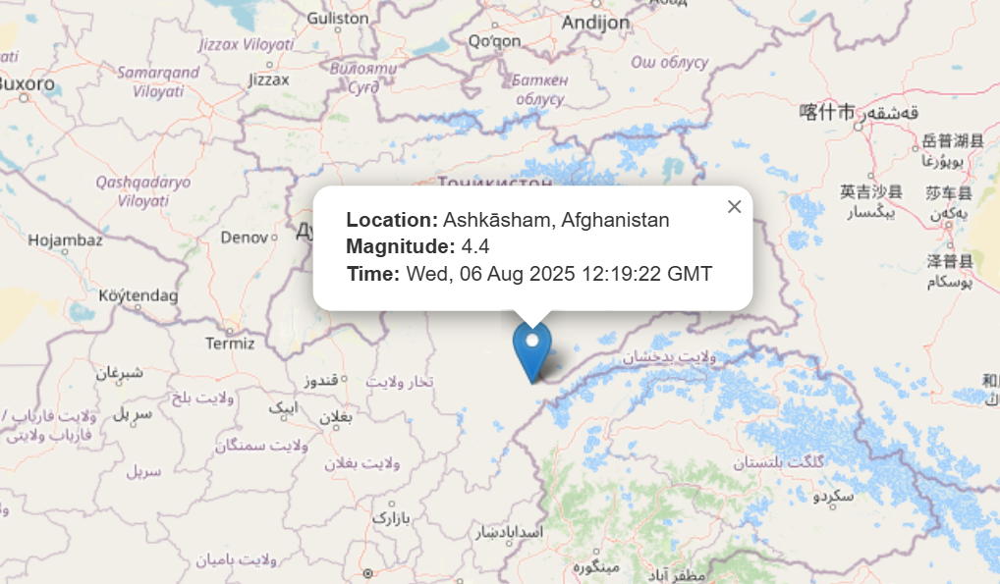

Here’s your updated **README.md** with the fix properly added (clean + professional for GitHub 👇)

---

# 🌍 Earthquake Monitoring Web App

A Python Flask-based web application that fetches recent earthquake data from the USGS API, stores it in a MySQL database, and displays it on an interactive Leaflet map.

---

## 📸 Demo




---

## 🚀 Features

* Fetches real-time earthquake data from USGS
* Stores filtered earthquakes (mag > 4.0) into MySQL
* Interactive Leaflet map to visualize earthquakes
* Time filter dropdown (1h to 24h)
* Auto-refreshes data when app starts

---

## ⚙️ Tech Stack

* Backend: Python, Flask
* Frontend: HTML, CSS, JavaScript, Leaflet.js
* Database: MySQL
* API Source: USGS Earthquake API

---

## 🛠 Setup Instructions

### 1. Clone the Repository

```bash
git clone https://github.com/your-username/earthquake-monitoring-app.git
cd earthquake-monitoring-app
```

---

### 2. Install Dependencies

```bash
pip install -r requirements.txt
```

---

### 3. Create MySQL Database

```sql
CREATE DATABASE earthquake_data;

USE earthquake_data;

CREATE TABLE earthquake (
    id INT AUTO_INCREMENT PRIMARY KEY,
    magnitude FLOAT,
    location VARCHAR(255),
    area VARCHAR(255),
    time DATETIME,
    country VARCHAR(100),
    latitude FLOAT,
    longitude FLOAT
);
```

---

### ⚠️ Important Fix (Avoid Data Too Long Error)

Some earthquake location strings can be very long, which may cause this error:

```
Data too long for column 'location'
```

To fix this, update column sizes:

```sql
ALTER TABLE earthquake MODIFY location VARCHAR(500);
ALTER TABLE earthquake MODIFY area VARCHAR(500);
ALTER TABLE earthquake MODIFY country VARCHAR(200);
```

---

### 4. Run the App

```bash
python app.py
```

Then open:

```
http://127.0.0.1:5000/
```

---

## 💡 Future Improvements

* Magnitude-based colored markers
* Real-time auto-refresh
* Heatmap visualization
* Country-based filtering
* Earthquake alerts system 🚨

---

If you want, I can next help you make this README **next-level (with badges, live demo, animations, and GitHub star appeal 🔥)**
